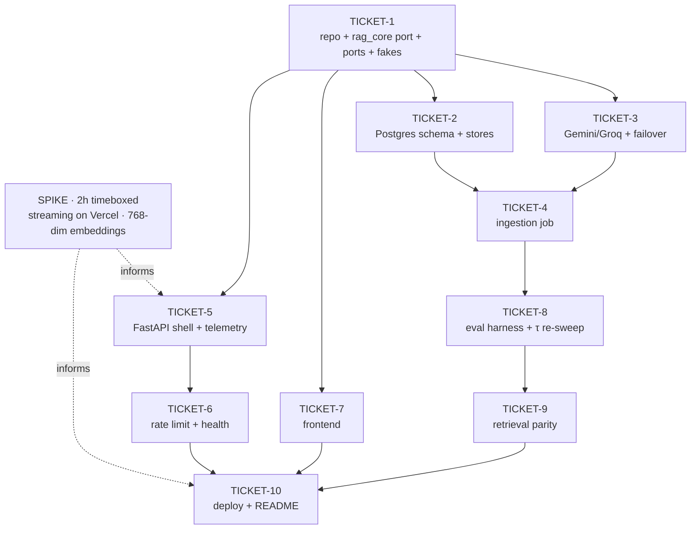

# Ticket Breakdown — Medical RAG, Hosted Version

Sliced from [ARCHITECTURE.md](../ARCHITECTURE.md) + [PRD.md](../PRD.md) · 17 Aug 2026

**Source of truth for the port:** `/Users/jsonse/Documents/development/interview/medical-rag`
(Django + `backend/rag/` + Next.js + `backend/evals/`). Referred to below as **the local repo**.

---

## Epic summary

Ship a publicly reachable version of the Medical RAG system — hybrid retrieval (dense + lexical),
reciprocal rank fusion, a two-stage confidence gate, and cited streaming answers — running on managed
infrastructure at zero recurring cost, against the three public-domain FDA drug labels the local build
already uses as its eval corpus.

The retrieval pipeline is ported unchanged; only inference and storage are replaced. Ollama →
Gemini + Groq. ChromaDB + SQLite FTS5 → one Postgres database with pgvector and a generated `tsvector`.

---

## Decisions taken at slicing time

These resolve ambiguities in the source docs. Where a decision contradicts a doc, the doc is wrong and
TICKET-1 corrects it.

| # | Decision | Consequence |
|---|---|---|
| D1 | **Standalone repo**, new GitHub repo `medical-rag-hosted-version`. Pipeline logic is ported from the local repo, not shared as a package. | Contradicts ADR-001, which chose a shared core. PRD G2 and success criterion 5 must be restated. Mitigation: pure modules ported verbatim + their test suite, so divergence fails a test. |
| D2 | **Reuse the existing corpus** — metformin, atenolol, amoxicillin, from `backend/evals/fixtures/`. Public domain (openFDA), pinned by `set_id`, with `verified_absent` axes. | No corpus-sourcing ticket. Answers PRD open question 3. Makes retrieval parity a true like-for-like comparison against `eval_results.md`. |
| D3 | **NDJSON**, not SSE. | Architecture §2 says SSE; the local build ships `application/x-ndjson`. Reusing the frame format lets the frontend port `lib/ndjson.ts` + `lib/chatReducer.ts` and their tests instead of rewriting the parser. Architecture doc corrected in TICKET-1. |
| D4 | **Keep the local chunker verbatim** — 1000 chars / 150 overlap, never spanning a page boundary. | Architecture §6 specifies ~800 tokens / 15% overlap / section-first splitting. Adopting that would invalidate every measured number in `eval_results.md` and change citation granularity. Page number becomes the schema's `anchor`. Doc corrected in TICKET-1. |
| D5 | **Pure modules stay sync; ports and pipeline are async.** | `chunking`/`fusion`/`gate`/`prompts`/sentinel are pure and port byte-identical. The store and provider ports go async so dense and lexical retrieval can be issued concurrently (NFR: retrieval < 400ms p50) under FastAPI. |
| D6 | **Both gate stages carry over.** | The architecture doc describes only stage 1. The local build also has a stage-2 model sentinel (`INSUFFICIENT_CONTEXT`), responsible for 9 of 25 declines in `eval_results.md`. Dropping it would silently degrade the refusal path. |

### Corrections to the source docs (TICKET-1 subtask)

- **ADR-001** — records "extract a shared core"; the decision is now a standalone port (D1). Rewrite the
  Decision and Consequences, keep the Options analysis, add the drift mitigation.
- **ADR-003** — its Context claims "the local implementation evaluates the confidence gate on the fused
  hybrid score." It does not. `chat/retrieval.py:1-6` and `rag/gate.py:59-67` gate on raw vector-leg
  `top_similarity` plus lexical support — already ADR-003's chosen Option C, pinned by
  `test_mean_similarity_does_not_affect_the_decision`. **Action item 4 ("backport the fix to the local
  profile") is a no-op.** What survives is the note that τ must be re-swept for a new embedding model.
- **Architecture §2** — SSE → NDJSON (D3).
- **Architecture §6** — chunking spec → the shipped char-based, page-bounded chunker (D4).
- **Architecture §7** — add the stage-2 sentinel gate (D6).
- **Architecture §5** — the schema references `document(id)` but never defines that table. TICKET-2 defines it.

---

## Spike (do this first — 2 hours, timeboxed, throwaway)

Not a ticket. Two load-bearing unknowns from PRD §11; if either fails, the deployment shape changes and
TICKET-5 / TICKET-10 are replanned.

1. **Streaming from a Python handler on Vercel.** Deploy a trivial FastAPI handler that emits NDJSON
   frames over 10 seconds. Confirm tokens arrive progressively in a browser, not buffered to the end.
   *This is the exact failure the local build hit under ASGI* — see the comment at `chat/views.py:279-284`,
   where a sync generator under ASGI delivered every token at once at 9.5s versus 0.7s under WSGI.
   Fallback if it fails: API on Hugging Face Spaces, frontend stays on Vercel.
2. **768-dimension embeddings.** Confirm the chosen Gemini embedding model emits 768-dim vectors via
   `output_dimensionality`, and check whether truncation from the native dimension requires
   renormalisation before cosine comparison (PRD open question 1 — assume yes, verify).

Record both results in `docs/SPIKE.md`. Delete the spike code.

---

## Tickets

### TICKET-1 — Repo scaffold and `rag_core` port

**Scope.** Stand up the repository and port the retrieval pipeline out of Django into a
framework-agnostic package with four provider ports and fake adapters.

- `git init`, create the GitHub repo `medical-rag-hosted-version`, push. *(Needs your GitHub account —
  the one step in this ticket that isn't local.)*
- Python project (`uv`, ≥3.12), lint/format/test config, CI workflow running the test suite.
- Port **verbatim** from `backend/rag/`: `chunking.py`, `fusion.py`, `gate.py`, `prompts.py`, and the
  sentinel half of `generation.py` (`filter_sentinel`, `_is_sentinel`, `BUFFER_CHARS`,
  `PREAMBLE_TOLERANCE`) into `rag_core/sentinel.py`. These carry their explanatory comments — the
  comments encode measured behaviour, not narration.
- Port their unit tests unchanged: `test_chunking`, `test_fusion`, `test_gate`, `test_prompts`,
  `test_generation` (sentinel cases), `test_rag_purity`. **These are the parity harness** — they are
  what makes D1's drift risk detectable.
- `rag_core/config.py` — port `RagConfig`, drop `OllamaConfig`, add `EmbeddingConfig` /
  `GenerationConfig` / `GateConfig`. Keep `tau_abstain` / `tau_strong` but **mark the 0.70/0.75 values
  invalid** with a comment pointing at TICKET-8; they were measured against `nomic-embed-text`.
- `rag_core/ports.py` — the four Protocols from Architecture §4, async where they do I/O
  (`EmbeddingProvider`, `GenerationProvider`, `DenseStore`, `LexicalStore`). `Scored` carries the
  provider's native score untransformed (ADR-003).
- `rag_core/pipeline.py` — port `chat/retrieval.py`'s `retrieve()` with the Django ORM removed.
  Hydration comes from the `DenseStore`/`LexicalStore` ports, not `Chunk.objects`. Dense and lexical
  legs issued concurrently (D5). The `mean_similarity` computation and its 20-line comment port as-is —
  it is recorded for the eval sweep and the gate must not read it.
- `rag_core/contracts.py` — `ContextChunk`, `Chunk`, `EmbeddedChunk`, `Vector`, plus the
  **NDJSON frame schema and telemetry payload** (gate decision + both signals separately per ADR-003
  action item 3, fused scores, retrieval latency, TTFT, total tokens, serving provider). Defining the
  wire contract here is what unblocks TICKET-5 and TICKET-7 to run in parallel.
- `rag_core/adapters/fakes.py` — in-memory fakes for all four ports, deterministic, no network.
- `rag_core/profile.py` — reads one env var at startup, resolves once into an adapter container.
  Ships with the fake profile wired; TICKET-2 and TICKET-3 each register one adapter into it.
- **Chunk ID shape:** the local `vector_id` is `f"{document_id}_{chunk_index}"` with an integer
  document id (`documents/models.py:36-39`), and `_hydrate` parses it with `partition("_")`. The hosted
  schema uses a **text** document id (a slug like `metformin`), so change the parse to split on the
  *last* underscore and cover it with a test. Getting this wrong silently drops every retrieved chunk —
  `_hydrate` skips unresolvable ids without erroring.
- Reconcile the source docs per **Corrections** above.

**Acceptance criteria.**
1. `uv run pytest` green, with no Django, no provider SDK, and no network reachable from `rag_core`.
2. `test_rag_purity` passes against the new package layout.
3. The ported unit tests pass unmodified against the ported modules — same assertions, same numbers.
4. A full `retrieve → gate → prompt → sentinel` round trip runs against fakes in under a second.
5. ARCHITECTURE.md and PRD.md reflect D1–D6; ADR-003's stale premise is corrected, not carried forward.

**Per-ticket context.** Architecture §3, §4, §7 · ADR-001 (now superseded by D1) · ADR-003 (premise
corrected) · PRD F5–F12 · local repo: `backend/rag/*`, `backend/chat/retrieval.py`,
`backend/chat/lexical_search.py`, `backend/documents/models.py`, `backend/tests/unit/*`.

**Files.** `rag_core/*`, `rag_core/adapters/fakes.py`, `tests/unit/*`, `pyproject.toml`,
`.github/workflows/test.yml`, `docs/ARCHITECTURE.md`, `docs/PRD.md`.
**Size.** ~1100–1400 lines incl. tests (a large share is mechanical port + doc edits).
**Depends on:** none.

---

### TICKET-2 — Postgres schema and the dense + lexical store adapter

**Scope.** One database serving both retrieval legs, plus the manifest that makes an embedding-model
mismatch impossible to serve through.

- Migration: `create extension vector`; the **`document` table the architecture doc omits**
  (`id text primary key`, `title`, `source_set_id`, `ingested_at`); `chunk` per Architecture §5 with
  `id text primary key`, `document_id text references document(id)`, `ordinal int`, `anchor text`
  (the page number, per D4), `content text`, `embedding vector(768)`, generated `tsv`,
  `unique (document_id, ordinal)`; HNSW `vector_cosine_ops` index; GIN index on `tsv`; `index_manifest`.
- `PostgresDenseStore` implementing `DenseStore` — `<=>` cosine distance, `k` nearest, returning
  `Scored[Chunk]` with the **raw distance** untransformed. `similarity = 1 - distance`, identical to the
  Chroma semantics the gate's τ was calibrated against (`rag/vectorstore.py:14-18`). Getting this
  backwards makes every threshold meaningless.
- `PostgresLexicalStore` implementing `LexicalStore` — `ts_rank_cd` over the generated `tsv`, ordered
  by rank. Port `rag/lexical.py`'s `build_fts_query` sanitisation; the FTS5 syntax it emits must be
  translated to `websearch_to_tsquery` or `plainto_tsquery`. **This is where lexical behaviour diverges
  from the local build** (ADR-002: `ts_rank_cd` is not BM25) — the divergence is measured in TICKET-9,
  not assumed negligible.
- Idempotent `upsert` on `(document_id, ordinal)`, and manifest read/write.
- Connection pooling suited to serverless (short-lived, pooled endpoint on Neon).
- Contract test suite runnable against **both** the Postgres adapter and the fakes, so both are held to
  one specification (Architecture §11).

**Acceptance criteria.**
1. Contract suite passes against fakes and against a real Postgres (testcontainers or a Neon branch).
2. Re-running `upsert` with the same chunks changes no row count and no id — idempotence proven, not asserted.
3. Dense search returns raw cosine distance; a test pins `1 - distance` against a known vector pair.
4. Lexical search returns results for a multi-word clinical query and empty (not an error) for a query
   that sanitises to nothing.
5. Reading the manifest when none has been written returns a distinguishable "absent", not a crash.

**Per-ticket context.** Architecture §5, §4 · ADR-002 in full · PRD F1, F3, F7 · local repo:
`backend/rag/vectorstore.py`, `backend/rag/lexical.py`, `backend/chat/lexical_search.py`,
`backend/documents/models.py`.

**Files.** `db/migrations/*.sql`, `rag_core/adapters/postgres.py`, `tests/contract/test_stores.py`,
`tests/conftest.py`.
**Size.** ~600–800 lines incl. tests.
**Depends on:** TICKET-1 (ports).

---

### TICKET-3 — Hosted provider adapters and the failover chain

**Scope.** Gemini embeddings, two generation providers, and automatic failover behind one port.

- `GeminiEmbedder` implementing `EmbeddingProvider` — 768 output dimensions, batching sized to the free
  quota, exponential backoff on 429. **Port the local repo's two protocol guards verbatim**
  (`rag/embeddings.py:44-56`): a returned-vector count that doesn't match the input count, and any
  vector of the wrong dimension, both raise rather than proceed. Silently misaligning chunk text with
  vectors poisons the store in a way retrieval can't detect.
- Renormalise after dimension truncation if the spike found it necessary; pin the decision in a test.
- `GroqGenerator` and `GeminiGenerator` implementing `GenerationProvider` — streaming token iterators,
  each reporting its `model_id`.
- `FailoverGenerator` — a `GenerationProvider` decorator: one retry on the primary, then fall to the
  secondary on rate limit or error. Reports which provider served the request (ADR-004). All generators
  unavailable raises a distinct error type so TICKET-5 can map it to an explicit service message rather
  than an ungrounded answer.
- Both adapters register into `rag_core/profile.py`'s container.
- Contract tests against the shared port suite, plus failover tests driven by fake transports — no live
  keys needed in CI.

**Acceptance criteria.**
1. Contract suite passes for both generation adapters and the embedder.
2. Primary rate-limited → exactly one retry → secondary serves → response reports the secondary. Proven
   with a fake transport, not by revoking a real key.
3. Both providers failing raises the distinct all-unavailable error, and never returns partial text as
   if it were an answer.
4. An embedder returning the wrong count or wrong dimension raises, with a message naming both numbers.
5. No provider SDK is importable from `rag_core` outside `rag_core/adapters/`.

**Per-ticket context.** Architecture §4, §8 · ADR-004 in full · PRD F6, F14, F16 · PRD open question 1
· local repo: `backend/rag/embeddings.py`, `backend/rag/generation.py`, `backend/rag/ollama.py`,
`backend/tests/contract/test_ollama_contract.py`.

**Files.** `rag_core/adapters/gemini.py`, `rag_core/adapters/groq.py`, `rag_core/adapters/failover.py`,
`tests/contract/test_providers.py`, `tests/unit/test_failover.py`.
**Size.** ~700–900 lines incl. tests.
**Depends on:** TICKET-1 (ports).

---

### TICKET-4 — Offline ingestion job

**Scope.** A CLI that builds the corpus, chunks it, embeds it, upserts it, and writes the manifest.
Runs on a laptop or in CI. Never in a request handler.

- Port `backend/evals/corpus.py` + `backend/evals/fixtures/*.json` + `manifest.json` (D2) — the three
  FDA labels, their `included_sections`, `withheld_sections`, and `verified_absent` axes. The
  `verified_absent` data is what makes the refusal path demonstrable and is reused by TICKET-8.
- Port `backend/tests/fixtures/make_fixture_pdf.py` and the pagination in `corpus.py` — real page
  numbers make citations meaningful and exercise the page-aware chunker (D4).
- `ingest/run.py` — parse → chunk (`rag_core.chunking`) → embed in quota-sized batches with backoff →
  upsert → write manifest. Resumable across runs, because a full pass on a free embedding quota may
  need to span more than one day (Architecture §6).
- **Ordering:** vectors and rows are the same row in Postgres now, so the local build's
  vectors-before-SQLite ordering (`documents/ingestion.py:1-7`) and its whole compensating-delete /
  `reconcile_vectors` apparatus become unnecessary. Do one transactional upsert instead. This is the
  structural win ADR-002 bought — collect it rather than porting the workaround.
- Write `index_manifest` last: `embedding_model_id`, `dimension`, `ingested_at`.

**Acceptance criteria.**
1. A full ingest of all three labels completes and reports chunk counts per document.
2. Re-running produces identical row count and identical chunk ids — idempotent (PRD F4).
3. Interrupting mid-run and resuming completes without duplicate or missing chunks.
4. The manifest matches the embedder that actually ran.
5. A chunk's `anchor` resolves to the page its text came from, checked against the built PDF.

**Per-ticket context.** Architecture §6, §5 · ADR-002 consequences · PRD F1, F2, F4, constraint
"free embedding tiers are quota-limited" · local repo: `backend/evals/corpus.py`,
`backend/evals/fixtures/*`, `backend/documents/ingestion.py`, `backend/tests/fixtures/make_fixture_pdf.py`.

**Files.** `ingest/*`, `corpus/fixtures/*`, `tests/integration/test_ingestion.py`.
**Size.** ~700–900 lines incl. tests and ported fixtures.
**Depends on:** TICKET-2, TICKET-3.

---

### TICKET-5 — FastAPI shell: NDJSON streaming, orchestration, telemetry

**Scope.** The transport layer. HTTP, streaming, error mapping, telemetry assembly. If a behaviour would
be identical over gRPC, it belongs in `rag_core`, not here.

- `POST /api/chat` — validate, run the pipeline, stream NDJSON frames (D3). Port `chat/streaming.py`'s
  `frame()` and the frame vocabulary from `chat/views.py`: `meta`, `token`, `sources`, `error`, `done`.
- Preserve the two ordering invariants the local build learned the hard way:
  `sources` is emitted **only after both gates have cleared** (`chat/views.py:209-212`), and retrieval
  runs **inside** the generator so an embedding-provider failure surfaces as an `error` frame rather
  than a truncated connection with no valid NDJSON (`chat/views.py:143-151`).
- Both gate stages (D6): stage 1 declines return server-authored copy from `rag_core.prompts`
  `decline_text()` with **no model call** (PRD F10, refusal < 800ms); stage 2 is the sentinel filter.
- **Telemetry** (PRD F13) — retrieval latency, TTFT, total tokens, serving provider, gate decision, and
  **both gate conditions reported separately** (ADR-003 action item 3: "being able to say *which*
  condition failed is worth the second parameter on its own").
- **Startup manifest check** — compare the configured embedder against `index_manifest`; on mismatch,
  refuse to serve and log loudly (Architecture §5, PRD F3). Serving an index built by a different model
  returns plausible-looking garbage, which is the worst failure mode available.
- Error mapping per Architecture §8. Single-turn only — history is `[]` (PRD non-goal).
- No sessions, no persistence, no accounts (PRD non-goals) — the local build's `ChatSession` /
  `ChatMessage` and the whole `finally`-block persistence dance at `chat/views.py:223-255` do **not**
  port. That removes the trickiest code in the local shell; don't recreate it.
- Integration tests against fake adapters end to end.

**Acceptance criteria.**
1. A question against fakes streams `meta` → `token`* → `sources` → `done`, in that order, progressively.
2. A stage-1 decline returns copy with zero calls to the generation port — asserted on a spy.
3. A stage-2 sentinel decline never leaks the raw `INSUFFICIENT_CONTEXT` token to the stream.
4. Manifest mismatch at startup → the service refuses to serve, with the two model ids in the log line.
5. Embedding-provider failure mid-request → a well-formed `error` frame plus `done`, never a truncated body.
6. Every response carries a telemetry payload with both gate conditions reported independently.

**Per-ticket context.** Architecture §3 (API shell), §7, §8 · PRD F5, F9–F13 · ADR-003 action item 3 ·
local repo: `backend/chat/views.py`, `backend/chat/streaming.py`,
`backend/tests/integration/test_chat_view.py`.

**Files.** `api/main.py`, `api/routes/chat.py`, `api/streaming.py`, `api/telemetry.py`, `api/errors.py`,
`api/startup.py`, `tests/integration/test_chat_api.py`.
**Size.** ~900–1100 lines incl. tests.
**Depends on:** TICKET-1 (ports, contracts, fakes).

---

### TICKET-6 — Rate limiting, health, and the failure surface

**Scope.** Everything that keeps the demo alive on free tiers and makes its failures legible.

- Per-IP rate limiting on every public endpoint via Upstash, returning a plain-language 429 with a retry
  hint rather than a raw status (PRD F15). In front of every endpoint from day one — a scraper burning
  the daily quota is a listed risk.
- `GET /api/health` — reports store reachability, manifest agreement, and per-provider availability.
  Port the local build's `_has_model` lesson (`chat/views.py:27-41`): a health check that reports a
  capability present when it is not converts a clear failure into an unexplained one later.
- A scheduled check that **exercises the secondary generation path deliberately** (ADR-004 action item 4
  — "if the secondary is never exercised in ninety days, test it deliberately rather than assuming it
  works").
- All-providers-down → explicit service message (PRD F16).

**Acceptance criteria.**
1. Exceeding the limit returns 429 with human-readable copy and a retry hint; under the limit is unaffected.
2. Rate-limit state survives across serverless invocations (it lives in Upstash, not process memory).
3. Health reports a manifest mismatch as unhealthy, not as a passing check with a warning.
4. The scheduled check exercises the secondary provider and fails loudly when it can't.
5. All generators unavailable → the service message, never an ungrounded answer — asserted.

**Per-ticket context.** Architecture §8, §9 · ADR-004 action item 4 · PRD F14–F16, risk table rows
"free tier limits tighten" and "a scraper burns the daily quota" · local repo: `backend/chat/views.py`
(`health`, `_has_model`).

**Files.** `api/ratelimit.py`, `api/routes/health.py`, `.github/workflows/healthcheck.yml`,
`tests/integration/test_ratelimit.py`, `tests/integration/test_health.py`.
**Size.** ~500–700 lines incl. tests.
**Depends on:** TICKET-5.

---

### TICKET-7 — Frontend: question box, streaming answer, telemetry strip

**Scope.** A single-purpose page. One question box, a streaming answer with inline citations, and a
telemetry strip. No upload, no document list, no chat history.

- Next.js app on Vercel. Port from the local repo's frontend: `lib/ndjson.ts` and its tests (D3 exists
  to make this reuse possible), `lib/chatReducer.ts` and its tests, `lib/copy.ts`, `lib/types.ts`.
- Port and simplify `AnswerText.tsx` (inline citation rendering), `MessageBubble.tsx`,
  `EvidencePanel.tsx` (source chips → citation resolution). **Do not port** `DocumentUploader.tsx`,
  `DocumentTable.tsx`, `app/documents/page.tsx` — upload is a PRD non-goal.
- **Telemetry strip** — gate decision with *both* conditions shown separately, fused scores, retrieval
  latency, TTFT, serving provider. This is a product feature, not debug output: it is the part that
  shows engineering rather than describing it (Architecture §3). Visible by default (PRD open question 4
  — resolve toward visible; the audience is a technical evaluator with ten minutes).
- **Refusal path must be discoverable in under a minute by someone not told about it** (PRD G5). The
  corpus is three drug labels with known absent axes; surface a couple of example questions, at least
  one of which refuses.
- Persistent, non-dismissable "not a clinical tool" disclaimer (PRD risk row).
- Accessibility per PRD §7: keyboard navigable, visible focus, `prefers-reduced-motion` respected.

**Acceptance criteria.**
1. Tokens render progressively as they arrive — not a single block at the end.
2. Every citation in the answer resolves to a source chunk with its document title and page anchor;
   an unresolvable citation is surfaced as a bug, not silently dropped (Architecture §7).
3. A refusal renders as a deliberate, designed state — not an error, not an empty answer.
4. The telemetry strip shows which gate condition failed on a refusal.
5. Keyboard-only traversal reaches every control with visible focus; reduced motion is honoured.
6. Ported `ndjson` and `chatReducer` tests pass unmodified.

**Per-ticket context.** Architecture §3 (Frontend) · PRD §3 (audience), G1, G5, G6, F11–F13, §7
(accessibility), open question 4 · local repo: `frontend/lib/*`, `frontend/components/AnswerText.tsx`,
`EvidencePanel.tsx`, `StatusBar.tsx`, `AppShell.tsx`.

**Files.** `web/app/*`, `web/components/*`, `web/lib/*`, `web/lib/*.test.ts`.
**Size.** ~800–1000 lines incl. tests.
**Depends on:** TICKET-1 (NDJSON frame + telemetry contract in `rag_core/contracts.py`).
*Can be built against a recorded NDJSON fixture before TICKET-5 lands.*

---

### TICKET-8 — Port the eval harness and re-sweep τ

**Scope.** The gate's thresholds are invalid until re-measured against the new embedding model. This
ticket makes them measured rather than guessed.

- Port `backend/evals/`: `collect.py` (the expensive pass — calls the LLM **unconditionally**, which is
  what lets the sweep model "what would stage 2 have done at a lower τ"), `metrics.py`, `sweep.py`,
  `axes.py`, `questions.yaml` (40 labelled questions across `answerable` / `near_miss` /
  `off_corpus_medical` / `off_domain`).
- Rewire the collect pass to the hosted stack — Postgres store, Gemini embedder, Groq/Gemini generation
  — and keep the permissive-gate trick at `collect.py:96` that forces chunks to hydrate regardless of
  the real gate's decision.
- Keep `choose_best`'s lexicographic ranking (`metrics.py:91-99`): **zero false declines first**, then
  recall, then LLM calls avoided. Not a blended F1 — an F1 objective trades away false declines, and a
  system that refuses questions it can answer is broken in the way users notice first.
- Run the sweep. Write `docs/EVAL_RESULTS.md` in the shape of the local repo's `eval_results.md`:
  signal distribution per bucket, the operating-point table, and the reasoning for the chosen point.
- Set the new `tau_abstain` / `tau_strong` in `rag_core/config.py`, replacing the invalid 0.70/0.75.

**Acceptance criteria.**
1. The collect pass runs all 40 questions against the hosted stack and writes `signals.json`.
2. The sweep reproduces the local harness's metric definitions exactly — `metrics.py` ports unmodified
   and its unit tests pass.
3. `docs/EVAL_RESULTS.md` reports the signal distribution per bucket and the operating-point table.
4. The chosen point has **zero false declines** on the `answerable` bucket, or the reason it can't is
   written down.
5. `config.py`'s thresholds are the swept values, with a comment naming the corpus and date they came from.
6. The new τ is stated alongside the local build's 0.70/0.75 with the distribution shift explained —
   ADR-003's note that "the old value must be discarded, not carried over" is honoured visibly.

**Per-ticket context.** ADR-003 (consequences + action item 2) · Architecture §11 (gate calibration) ·
PRD risk "gate threshold mis-tuned after the embedding change" (likelihood: High) · local repo:
`backend/evals/*`, `backend/evals/eval_results.md`.

**Files.** `evals/*`, `docs/EVAL_RESULTS.md`, `rag_core/config.py`, `tests/unit/test_eval_metrics.py`.
**Size.** ~700–900 lines incl. ported tests.
**Depends on:** TICKET-4 (needs an ingested hosted index).

---

### TICKET-9 — Retrieval parity measurement

**Scope.** PRD G3 and success criterion 3 claim retrieval quality at or above the local baseline. The
existing harness cannot support that claim — it measures **gate calibration** (decline precision/recall),
not **retrieval quality**. Architecture §11 asks for recall@k and MRR against a fixed question set with
known relevant chunks, and that ground truth does not exist yet. This ticket builds it.

- Add a `relevant_chunks` field to `questions.yaml` for the `answerable` bucket — the chunk ids that
  genuinely answer each question. Derive them from the `included_sections` structure in
  `fixtures/manifest.json` and verify by hand; a wrong label here corrupts every number downstream.
- Implement `recall@k` and `MRR` over the collect pass's `retrieved` field (already recorded at
  `collect.py:130`).
- Measure **both legs and the fused ranking separately** — this is where ADR-002's honest cost lands:
  `ts_rank_cd` is a coverage-density ranking, not BM25's term-frequency saturation, so the lexical leg
  is expected to differ. Report the difference; do not average it away.
- Run against the hosted profile. Compare against the local baseline by running the local repo's
  harness with the same labels, so both numbers come from the same question set.
- Publish in `docs/EVAL_RESULTS.md` and the README (ADR-002 action item 3: "document the ranking
  difference in the README rather than hiding it").

**Acceptance criteria.**
1. Every `answerable` question carries at least one verified `relevant_chunk`.
2. `recall@k` and `MRR` computed for dense, lexical, and fused rankings, hosted and local.
3. The lexical-leg difference between BM25 and `ts_rank_cd` is quantified, with a stated direction and
   magnitude — not "roughly comparable".
4. If hosted retrieval is **below** the local baseline, that is written down plainly with the gap, not
   worked around. PRD G3 is then a known open item, not a silently failed claim.
5. Metric implementations are unit tested against hand-computed rankings.

**Per-ticket context.** PRD G3, success criterion 3, risk "embedding swap degrades retrieval" ·
Architecture §11 (retrieval evaluation), §10 (`ts_rank_cd` is not BM25) · ADR-002 action items 2 and 3 ·
local repo: `backend/evals/questions.yaml`, `backend/evals/metrics.py`, `backend/evals/collect.py:130`.

**Files.** `evals/questions.yaml`, `evals/retrieval_metrics.py`, `evals/parity.py`,
`docs/EVAL_RESULTS.md`, `tests/unit/test_retrieval_metrics.py`.
**Size.** ~500–700 lines incl. tests and label data.
**Depends on:** TICKET-8 (shares `evals/` and the collect pass output).

---

### TICKET-10 — Deploy and publish

**Scope.** Get it live, keep it free, and write the README that makes the argument.

- Vercel project (frontend + Python API), Neon Postgres with pgvector, Upstash for rate-limit counters.
  Environment and secret configuration; the profile env var resolved once at startup.
- Ingest the corpus into the production database (TICKET-4's CLI, run from a laptop or a GitHub Actions job).
- README: what it is, the published retrieval and gate numbers from TICKET-8 and TICKET-9, the
  local-vs-hosted argument (why the local build exists and why this one does too), and the
  **Limitations section verbatim from Architecture §10** — including "not a clinical tool", the
  no-re-ranker note, the single-turn limit, and that the gate cannot detect a confidently wrong corpus.
- State the free-tier / best-effort availability position on the page (PRD §7).
- Cost verification: confirm every service sits on a free tier with no expiring trial credit. PRD
  success criterion 6 — "thirty days after deploy, the demo still works and has cost nothing" — is
  called out as the criterion most likely to fail, so check expiry dates explicitly, not just current spend.

**Acceptance criteria.**
1. A stranger with the URL reaches a cited answer with no instructions (PRD criterion 1).
2. An out-of-corpus question refuses, and the refusal reads as deliberate (PRD criterion 2).
3. Revoking the primary provider's key in a preview environment still returns a working answer, with the
   swap visible in the telemetry strip (PRD criterion 4).
4. Cold start to first token under 5s; TTFT under 2.5s p50 on a warm path (PRD G1, §7).
5. Every service is on a non-expiring free tier — each one checked and recorded, with renewal dates
   where they exist.
6. README publishes the actual measured numbers, including any that came out worse than the local build.

**Per-ticket context.** Architecture §9, §10 · PRD G1, G4, §7, success criteria 1–4 and 6, constraint
"Vercel Hobby is non-commercial only" · ADR-004 (why two providers).

**Files.** `vercel.json`, `web/next.config.ts`, `.env.example`, `README.md`, `docs/DEPLOYMENT.md`.
**Size.** ~300–500 lines (config + prose).
**Depends on:** TICKET-6, TICKET-7, TICKET-9.

---

## Dependency graph

---

## Suggested execution order

| Wave | Tickets | Parallel? | Notes |
|---|---|---|---|
| **0** | SPIKE | — | 2 hours, timeboxed, throwaway. A failure here replans TICKET-5 and TICKET-10. |
| **1** | TICKET-1 | serial | Everything depends on the ports and the wire contract. Keep it tight and land it fast. |
| **2** | TICKET-2 · TICKET-3 · TICKET-5 · TICKET-7 | **4 worktrees** | No file overlap: `adapters/postgres.py` + `db/`, `adapters/{gemini,groq,failover}.py`, `api/`, `web/`. |
| **3** | TICKET-4 · TICKET-6 | **2 worktrees** | TICKET-4 needs both adapters; TICKET-6 needs the shell. |
| **4** | TICKET-8 | serial | Needs a populated hosted index. |
| **5** | TICKET-9 | serial | Shares `evals/` and the collect output with TICKET-8. |
| **6** | TICKET-10 | serial | Integration and publication. |

**Parallelism note.** The only shared-file risk in Wave 2 is `rag_core/profile.py` — TICKET-2 and
TICKET-3 each register one adapter into the container. TICKET-1 should ship the container with an
env-var resolver and an explicit registration seam so each is a one-line addition, not a rewrite.

**Just-in-time planning.** Plan each ticket when its dependency is *implemented*, not when it's sliced.
TICKET-4's plan in particular should be written after TICKET-2 and TICKET-3 land — the real shape of the
batching and backoff depends on what the provider quota turns out to be.

**Milestone tension, stated plainly.** PRD §11 budgets this as Day 1 + Day 2. Ten tickets at 500–1400
lines each is not two days of work at any honest estimate. The slicing reflects the work; the schedule
is yours to set. If it must compress, TICKET-9 (retrieval parity) is the one whose absence is most
visible — it is the evidence for PRD G3, and dropping it means the parity claim comes out of the README.

---

## Open items carried forward

1. **PRD G2 and success criterion 5 are unsatisfiable as written** under the standalone-repo decision
   (D1). Restate them in TICKET-1: the claim becomes "the pure core is a verbatim port carrying its own
   test suite, so behavioural divergence fails a test" rather than "both profiles run from one package".
2. **ADR-001 documents a decision that was not taken.** Rewrite, don't delete — the Options analysis is
   still the reasoning, and the trade-off it names (two copies drift within weeks) is now a live risk
   this repo has to manage rather than one it avoided.
3. **PRD open question 2** (`ts_rank` vs `ts_rank_cd`) is answered by measurement in TICKET-9, not by argument.
4. **PRD open question 3** (is one corpus enough for a natural refusal path) is answered by D2 — the
   three-label corpus with `verified_absent` axes already has obvious edges.
5. **The four ports have one real implementation each** in this repo. ADR-001's consequence says to
   delete a port that never gets a second implementation. The fakes are the second implementation and
   they are what make the core testable with no network — that is the justification, and it should be
   written down rather than left implicit.
